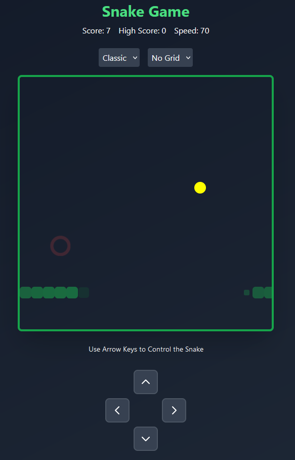

 
# 🐍 Snake Game

A modern interpretation of the classic Nokia Snake game built with React, TypeScript, and Framer Motion.



## 🎮 Features

- **Multiple Theme Options**: Choose between Classic, Neon, and Retro visual styles
- **Dynamic Difficulty**: Game speeds up as your score increases
- **Power-ups System**:
  - 🚀 Speed Boost
  - ✨ Score Multiplier
  - 🛡️ Shield (Coming Soon)
- **Responsive Controls**: Use keyboard arrows or on-screen controls
- **Visual Effects**: Smooth animations and particle effects
- **High Score Tracking**: Compete against your best performance
- **Pause Functionality**: Take a break with space bar or ESC key

## 🎯 How to Play

1. Use arrow keys or on-screen controls to guide the snake
2. Eat food (red dots) to grow longer and increase your score
3. Collect power-ups for special abilities:
   - Yellow orb: Increases speed
   - Purple orb: Multiplies your score
   - Blue orb: Shield protection (coming soon)
4. Avoid colliding with yourself
5. Try to achieve the highest score possible!

## 🛠️ Technical Stack

- React 18
- TypeScript
- Framer Motion for animations
- TailwindCSS for styling
- Vite for development and building

## 🚀 Getting Started

1. Clone the repository:
```bash
git clone https://github.com/belikeadam/snake-game.git
```

2. Install dependencies:
```bash
cd snake-game
npm install
```

3. Start the development server:
```bash
npm run dev
```

4. Build for production:
```bash
npm run build
```

## 🎨 Customization

- **Themes**: Switch between Classic, Neon, and Retro themes
- **Grid Patterns**: Choose between None, Dots, or Lines
- **Difficulty Levels**: Easy, Medium, or Hard modes
- **Trail Effect**: Enable/disable snake trail visualization

## 🎮 Controls

- ⬆️ Arrow Up: Move Up
- ⬇️ Arrow Down: Move Down
- ⬅️ Arrow Left: Move Left
- ➡️ Arrow Right: Move Right
- Space/ESC: Pause Game

## 📱 Progressive Web App

This game is built as a PWA, allowing you to:
- Install it on your device
- Play offline
- Get a native app-like experience

## 🤝 Contributing

Contributions are welcome! Feel free to:
- Report bugs
- Suggest new features
- Submit pull requests

## 📜 License

This project is open source and available under the MIT License.
```

This README provides a comprehensive overview of your Snake Game implementation, highlighting its features, technical aspects, and how to get started. It's structured to help users understand both how to play the game and how to work with the codebase.
This README provides a comprehensive overview of your Snake Game implementation, highlighting its features, technical aspects, and how to get started. It's structured to help users understand both how to play the game and how to work with the codebase.